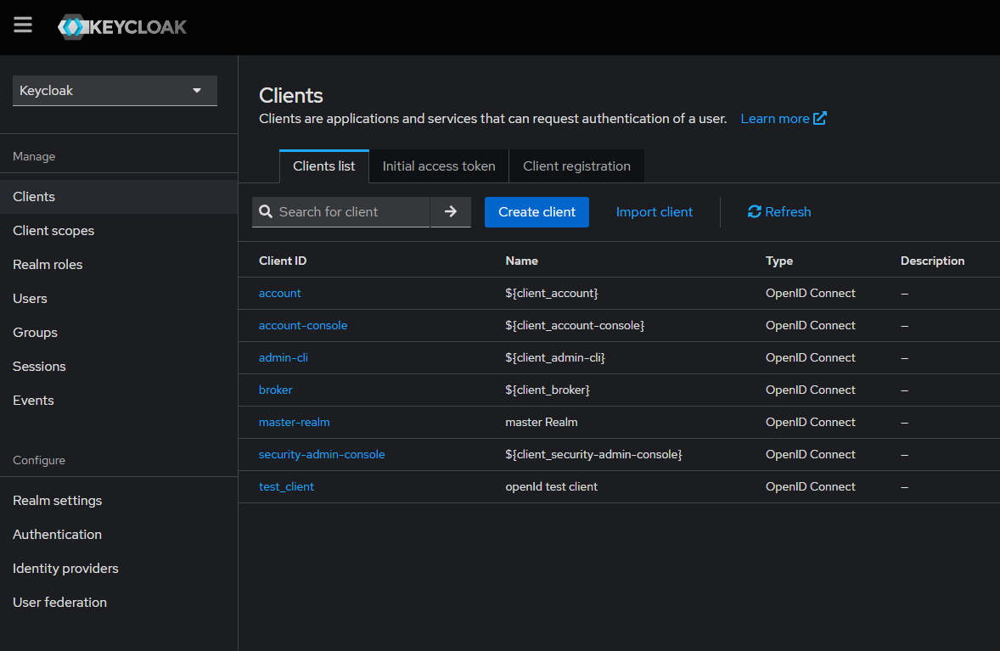

# swagger ui center

## redis server (for auth)

```bash
docker run -d -p 6379:6379 --name local-redis redis
```

## key clock prepare

### run keycloak

```bash
docker run -d -p 8080:8080 -p 8443:8443 \
    -e KEYCLOAK_ADMIN=user \
    -e KEYCLOAK_ADMIN_PASSWORD=password \
    quay.io/keycloak/keycloak start-dev
```

### import test client

client id testing json : [link](./keycloak/test_client.json)

- open clients page
    
- click import client
    

## memo

- [Swashbuckle.AspNetCore is being removed in .NET 9](https://github.com/dotnet/aspnetcore/issues/54599)